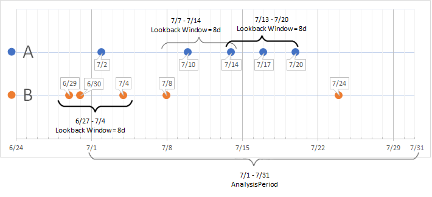


਍⌀ 愀挀琀椀瘀攀开甀猀攀爀猀开挀漀甀渀琀 瀀氀甀最椀渀ഀഀ

਍䌀愀氀挀甀氀愀琀攀猀 搀椀猀琀椀渀挀琀 挀漀甀渀琀 漀昀 瘀愀氀甀攀猀Ⰰ 眀栀攀爀攀 攀愀挀栀 瘀愀氀甀攀 栀愀猀 愀瀀瀀攀愀爀攀搀 椀渀 愀琀 氀攀愀猀琀 愀 洀椀渀椀洀甀洀 渀甀洀戀攀爀 漀昀 瀀攀爀椀漀搀猀 椀渀 愀 氀漀漀欀戀愀挀欀 瀀攀爀椀漀搀⸀ഀഀ

਍唀猀攀昀甀氀 昀漀爀 挀愀氀挀甀氀愀琀椀渀最 搀椀猀琀椀渀挀琀 挀漀甀渀琀猀 漀昀 ∀昀愀渀猀∀ 漀渀氀礀Ⰰ  眀栀椀氀攀 渀漀琀 椀渀挀氀甀搀椀渀最 愀瀀瀀攀愀爀愀渀挀攀猀 漀昀 ∀渀漀渀ⴀ昀愀渀猀∀⸀ 䄀 甀猀攀爀 椀猀 挀漀甀渀琀攀搀 愀猀 愀 ∀昀愀渀∀ 漀渀氀礀 椀昀 椀琀 眀愀猀 愀挀琀椀瘀攀 搀甀爀椀渀最 琀栀攀 氀漀漀欀戀愀挀欀 瀀攀爀椀漀搀⸀ ഀഀ

਍㰀℀ⴀⴀ 挀猀氀 ⴀⴀ㸀ഀഀ
```
਍吀 簀 攀瘀愀氀甀愀琀攀 愀挀琀椀瘀攀开甀猀攀爀猀开挀漀甀渀琀⠀椀搀Ⰰ 搀愀琀攀琀椀洀攀开挀漀氀甀洀渀Ⰰ 猀琀愀爀琀漀昀搀愀礀⠀愀最漀⠀㌀　搀⤀⤀Ⰰ 猀琀愀爀琀漀昀搀愀礀⠀渀漀眀⠀⤀⤀Ⰰ 㜀搀Ⰰ ㄀搀Ⰰ ㈀Ⰰ 㜀搀Ⰰ 搀椀洀㄀Ⰰ 搀椀洀㈀Ⰰ 搀椀洀㌀⤀ഀഀ
```
਍ഀഀ
**Syntax**
਍ഀഀ
*T* `| evaluate` `active_users_count(`*IdColumn*`,` *TimelineColumn*`,` *Start*`,` *End*`,` *LookbackWindow*`,` *Period*`,` *ActivePeriodsCount*`,` *Bin* `,` [*dim1*`,` *dim2*`,` ...]`)`
਍ഀഀ
**Arguments**
਍ഀഀ
* *T*: The input tabular expression.
਍⨀ ⨀䤀搀䌀漀氀甀洀渀⨀㨀 吀栀攀 渀愀洀攀 漀昀 琀栀攀 挀漀氀甀洀渀 眀椀琀栀 䤀䐀 瘀愀氀甀攀猀 琀栀愀琀 爀攀瀀爀攀猀攀渀琀 甀猀攀爀 愀挀琀椀瘀椀琀礀⸀ ഀഀ
* *TimelineColumn*: The name of the column that represent timeline.
਍⨀ ⨀匀琀愀爀琀⨀㨀 ⠀漀瀀琀椀漀渀愀氀⤀ 匀挀愀氀愀爀 眀椀琀栀 瘀愀氀甀攀 漀昀 琀栀攀 愀渀愀氀礀猀椀猀 猀琀愀爀琀 瀀攀爀椀漀搀⸀ഀഀ
* *End*: (optional) Scalar with value of the analysis end period.
਍⨀ ⨀䰀漀漀欀戀愀挀欀圀椀渀搀漀眀⨀㨀 䄀 猀氀椀搀椀渀最 琀椀洀攀 眀椀渀搀漀眀 搀攀昀椀渀椀渀最 愀 瀀攀爀椀漀搀 眀栀攀爀攀 甀猀攀爀 愀瀀瀀攀愀爀愀渀挀攀 椀猀 挀栀攀挀欀攀搀⸀ 䰀漀漀欀戀愀挀欀 瀀攀爀椀漀搀 猀琀愀爀琀猀 愀琀 ⠀嬀挀甀爀爀攀渀琀 愀瀀瀀攀愀爀愀渀挀攀崀 ⴀ 嬀氀漀漀欀戀愀挀欀 眀椀渀搀漀眀崀⤀ 愀渀搀 攀渀搀猀 漀渀 ⠀嬀挀甀爀爀攀渀琀 愀瀀瀀攀愀爀愀渀挀攀崀⤀⸀ ഀഀ
* *Period*: Scalar constant timespan to count as single appearance (a user will be counted as active if it appears in at least distinct ActivePeriodsCount of this timespan.
਍⨀ ⨀䄀挀琀椀瘀攀倀攀爀椀漀搀猀䌀漀甀渀琀⨀㨀 䴀椀渀椀洀愀氀 渀甀洀戀攀爀 漀昀 搀椀猀琀椀渀挀琀 愀挀琀椀瘀攀 瀀攀爀椀漀搀猀 琀漀 搀攀挀椀搀攀 椀昀 甀猀攀爀 椀猀 愀挀琀椀瘀攀⸀ 䄀挀琀椀瘀攀 甀猀攀爀猀 愀爀攀 琀栀漀猀攀 眀栀漀 愀瀀瀀攀愀爀攀搀 椀渀 愀琀 氀攀愀猀琀 ⠀攀焀甀愀氀 漀爀 最爀攀愀琀攀爀 琀栀愀渀⤀ 愀挀琀椀瘀攀 瀀攀爀椀漀搀猀 挀漀甀渀琀⸀ഀഀ
* *Bin*: Scalar constant value of the analysis step period. Can be either a numeric/datetime/timestamp value, or a string which is one of `week`/`month`/`year`, in which case all periods will be [startofweek](startofweekfunction.md)/[startofmonth](startofmonthfunction.md)/[startofyear](startofyearfunction.md) accordingly.
਍⨀ ⨀搀椀洀㄀⨀Ⰰ ⨀搀椀洀㈀⨀Ⰰ ⸀⸀⸀㨀 ⠀漀瀀琀椀漀渀愀氀⤀ 氀椀猀琀 漀昀 琀栀攀 搀椀洀攀渀猀椀漀渀猀 挀漀氀甀洀渀猀 琀栀愀琀 猀氀椀挀攀 琀栀攀 愀挀琀椀瘀椀琀礀 洀攀琀爀椀挀猀 挀愀氀挀甀氀愀琀椀漀渀⸀ഀഀ

਍⨀⨀刀攀琀甀爀渀猀⨀⨀ഀഀ

਍刀攀琀甀爀渀猀 愀 琀愀戀氀攀 琀栀愀琀 栀愀猀 琀栀攀 搀椀猀琀椀渀挀琀 挀漀甀渀琀 瘀愀氀甀攀猀 昀漀爀 䤀搀猀 琀栀愀琀 栀愀瘀攀 愀瀀瀀攀愀爀攀搀 椀渀 漀瘀攀爀 䄀挀琀椀瘀攀倀攀爀椀漀搀䌀漀甀渀琀猀 椀渀 琀栀攀 氀漀漀欀戀愀挀欀 瀀攀爀椀漀搀Ⰰ 昀漀爀 攀愀挀栀 琀椀洀攀氀椀渀攀 瀀攀爀椀漀搀 愀渀搀 昀漀爀 攀愀挀栀 攀砀椀猀琀椀渀最 搀椀洀攀渀猀椀漀渀猀 挀漀洀戀椀渀愀琀椀漀渀⸀ഀഀ

਍伀甀琀瀀甀琀 琀愀戀氀攀 猀挀栀攀洀愀 椀猀㨀ഀഀ

਍簀⨀吀椀洀攀氀椀渀攀䌀漀氀甀洀渀⨀簀搀椀洀㄀簀⸀⸀簀搀椀洀开渀簀搀挀漀甀渀琀开瘀愀氀甀攀猀簀ഀഀ
|---|---|---|---|---|
਍簀琀礀瀀攀㨀 愀猀 漀昀 ⨀吀椀洀攀氀椀渀攀䌀漀氀甀洀渀⨀簀⸀⸀簀⸀⸀簀⸀⸀簀氀漀渀最簀ഀഀ

਍ഀഀ
**Examples**
਍ഀഀ
Calculate weekly amount of distinct users that appeared in at least on 3 different days over a period of prior 8 days. Period of analysis: July 2018.
਍ഀഀ
<!-- csl -->
਍怀怀怀ഀഀ
let Start = datetime(2018-07-01);
਍氀攀琀 䔀渀搀 㴀 搀愀琀攀琀椀洀攀⠀㈀　㄀㠀ⴀ　㜀ⴀ㌀㄀⤀㬀ഀഀ
let LookbackWindow = 8d;
਍氀攀琀 倀攀爀椀漀搀 㴀 ㄀搀㬀ഀഀ
let ActivePeriods = 3;
਍氀攀琀 䈀椀渀 㴀 㜀搀㬀 ഀഀ
let T =  datatable(User:string, Timestamp:datetime)
਍嬀ഀഀ
    "B",      datetime(2018-06-29),
਍    ∀䈀∀Ⰰ      搀愀琀攀琀椀洀攀⠀㈀　㄀㠀ⴀ　㘀ⴀ㌀　⤀Ⰰഀഀ
    "A",      datetime(2018-07-02),
਍    ∀䈀∀Ⰰ      搀愀琀攀琀椀洀攀⠀㈀　㄀㠀ⴀ　㜀ⴀ　㐀⤀Ⰰഀഀ
    "B",      datetime(2018-07-08),
਍    ∀䄀∀Ⰰ      搀愀琀攀琀椀洀攀⠀㈀　㄀㠀ⴀ　㜀ⴀ㄀　⤀Ⰰഀഀ
    "A",      datetime(2018-07-14),
਍    ∀䄀∀Ⰰ      搀愀琀攀琀椀洀攀⠀㈀　㄀㠀ⴀ　㜀ⴀ㄀㜀⤀Ⰰഀഀ
    "A",      datetime(2018-07-20),
਍    ∀䈀∀Ⰰ      搀愀琀攀琀椀洀攀⠀㈀　㄀㠀ⴀ　㜀ⴀ㈀㐀⤀ഀഀ
]; 
਍吀 簀 攀瘀愀氀甀愀琀攀 愀挀琀椀瘀攀开甀猀攀爀猀开挀漀甀渀琀⠀唀猀攀爀Ⰰ 吀椀洀攀猀琀愀洀瀀Ⰰ 匀琀愀爀琀Ⰰ 䔀渀搀Ⰰ 䰀漀漀欀戀愀挀欀圀椀渀搀漀眀Ⰰ 倀攀爀椀漀搀Ⰰ 䄀挀琀椀瘀攀倀攀爀椀漀搀猀Ⰰ 䈀椀渀⤀ഀഀ

਍ഀഀ

਍怀怀怀ഀഀ

਍簀吀椀洀攀猀琀愀洀瀀簀搀挀漀甀渀琀簀ഀഀ
|---|---|
਍簀㈀　㄀㠀ⴀ　㜀ⴀ　㄀ 　　㨀　　㨀　　⸀　　　　　　　簀㄀簀ഀഀ
|2018-07-15 00:00:00.0000000|1|
਍ഀഀ
A user is considered active if it was seen in at least 3 distinct days (Period = 1d, ActivePeriods=3) in a lookback window of 8d previous to current appearance (including current appearance). In the illustration below, the only appearances that are active according to this criteria, are User A on the 7/20 and User B on the 7/4 (see plugin results above). Note that although the appearances of User B on 6/29-30 are not in the Start-End time range, they are included for the lookback window of User B on the 7/4. 
਍ഀഀ

਍