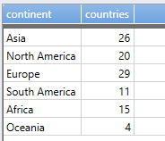
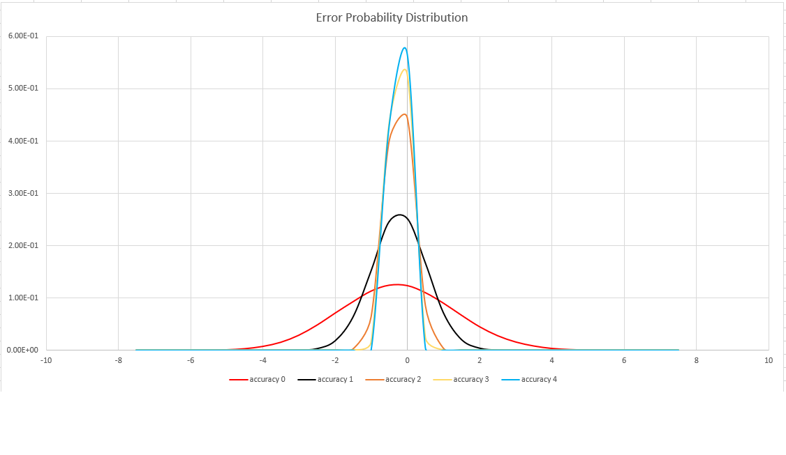

# dcount() (aggregation function)

Returns an estimate for the number of distinct values taken by a scalar expression in the summary group.

**Syntax**

... `|` `summarize` `dcount` `(`*Expr* [`,` *Accuracy*]`)` ...

**Arguments**

* *Expr*: A scalar expression whose distinct values are to be counted.
* *Accuracy*: An optional `int` literal that defines the requested estimation
  accuracy. See below for supported values. If unspecified, the default value
  `1` is used.

**Returns**

Returns an estimate of the number of distinct values of *Expr* in the group.

**Example**

```
PageViewLog | summarize countries=dcount(country) by continent
```



**Notes**

The `dcount()` aggregation function is primarily useful for estimating the
cardinality of huge sets. It trades performance for accuracy, and therefore may
return a result that varies between executions (order of
inputs may have an effect on its output).

To get an accurate count of distinct values of `V` grouped by `G`:

```
T | summarize by V, G | summarize count() by G
```

This calculation will require much internal memory since distinct values of `V` are multiplied by the number of distinct values of `G`;
Therefore, it may result in memory errors or large execution times. `dcount()`provides a fast and reliable alternative:

```
T | summarize dcount(B) by G | count
```

## Estimation accuracy

The `dcount()` aggregate function uses a variant of the
[HyperLogLog (HLL) algorithm](https://en.wikipedia.org/wiki/HyperLogLog),
which does a stochastic estimation of set cardinality. The algorithm provides
a "knob" that can be used to balance accuracy and execution time / memory size:

|Accuracy|Error (%)|Entry count   |
|--------|---------|--------------|
|       0|      1.6|2<sup>12</sup>|
|       1|      0.8|2<sup>14</sup>|
|       2|      0.4|2<sup>16</sup>|
|       3|     0.28|2<sup>17</sup>|
|       4|      0.2|2<sup>18</sup>|

> [!NOTE]
> The "entry count" column is the number of 1-byte counters in the HLL
implementation.

The algorithm includes some provisions for doing a perfect count (zero error)
if the set cardinality is small enough (1000 values when the accuracy level is `1`,
and 8000 values if the accuracy level is `2`).

The error bound is probabilistic, not a theoretical bound. The value
is the standard deviation of error distribution (the sigma), and 99.7%
of the estimations will have a relative error of under 3 times sigma.

The following depicts the probability distribution function of the relative
estimation error (in percentages) for all supported accuracy settings:


