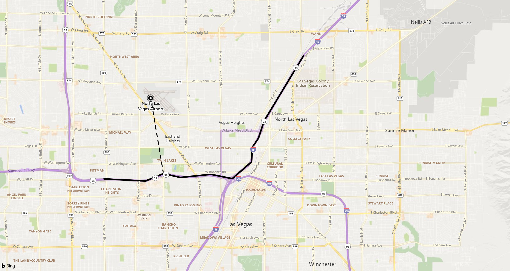

# geo_distance_point_to_line()

Calculates shortest distance between coordinate and line on Earth.

**Syntax**

`geo_distance_point_to_line(`*longitude*`, `*latitude*`, `*lineString*`)`

**Arguments**

* *longitude*: Geospatial coordinate longitude value in degrees. Valid value is a real number and in the range [-180, +180].
* *latitude*: Geospatial coordinate latitude value in degrees. Valid value is a real number and in the range [-90, +90].
* *lineString*: Line in the [GeoJSON format](https://tools.ietf.org/html/rfc7946) and of a [dynamic](./scalar-data-types/dynamic.md) data type.

**Returns**

The shortest distance in meters between coordinate and line on Earth. If the coordinate or lineString are invalid, the query will produce a null result.

> [!NOTE]
> * The geospatial coordinates are interpreted as represented by the [WGS-84](https://earth-info.nga.mil/GandG/update/index.php?action=home) coordinate reference system.
> * The [geodetic datum](https://en.wikipedia.org/wiki/Geodetic_datum) used to measure distance on Earth is a sphere. Line edges are geodesics on the sphere.

**LineString definition and constraints**

dynamic({"type": "LineString","coordinates": [ [lng_1,lat_1], [lng_2,lat_2] ,..., [lng_N,lat_N] ]})

* LineString coordinates array must contain at least 2 entries.
* Coordinates [longitude,latitude] must be valid where longitude is a real number in range [-180, +180] and latitude is a real number in range [-90, +90].
* Edge length must be less than 180 degrees. The shortest edge between the two vertices will be chosen.

> [!TIP]
> Using literal lines may result in better performance.

**Examples**

The following example finds the shortest distance between North Las Vegas Airport and nearby road.


<!-- csl: https://help.kusto.windows.net/Samples -->
```
print distance_in_meters = geo_distance_point_to_line(-115.199625, 36.210419, dynamic({ "type":"LineString","coordinates":[[-115.115385,36.229195],[-115.136995,36.200366],[-115.140252,36.192470],[-115.143558,36.188523],[-115.144076,36.181954],[-115.154662,36.174483],[-115.166431,36.176388],[-115.183289,36.175007],[-115.192612,36.176736],[-115.202485,36.173439],[-115.225355,36.174365]]}))
```

|distance_in_meters|
|---|
|3797.88887253334|

The following example will return a null result because of the invalid LineString input.
<!-- csl: https://help.kusto.windows.net/Samples -->
```
print distance_in_meters = geo_distance_point_to_line(1,1, dynamic({ "type":"LineString"}))
```

|distance_in_meters|
|---|
||

The following example will return a null result because of the invalid coordinate input.
<!-- csl: https://help.kusto.windows.net/Samples -->
```
print distance_in_meters = geo_distance_point_to_line(300, 3, dynamic({ "type":"LineString","coordinates":[[1,1],[2,2]]}))
```

|distance_in_meters|
|---|
||
