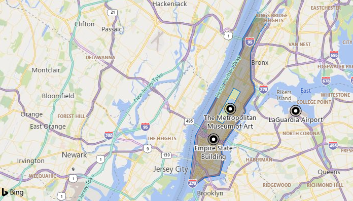

# geo_point_in_polygon()

Calculates whether the geospatial coordinates are inside a polygon on Earth.

**Syntax**

`geo_point_in_polygon(`*longitude*`, `*latitude*`, `*polygon*`)`

**Arguments**

* *longitude*: Geospatial coordinate, longitude value in degrees. Valid value is a real number and in range [-180, +180].
* *latitude*: Geospatial coordinate, latitude value in degrees. Valid value is a real number and in range [-90, +90].
* *polygon*: Polygon in the [GeoJSON format](https://tools.ietf.org/html/rfc7946) and of a [dynamic](./scalar-data-types/dynamic.md) data type.

**Returns**

Indicates whether the geospatial coordinates are inside a polygon. If the coordinates or polygon are invalid, the query will produce a null result. 

> [!NOTE]
> * The geospatial coordinates are interpreted as represented by the [WGS-84](https://earth-info.nga.mil/GandG/update/index.php?action=home) coordinate reference system.
> * The [geodetic datum](https://en.wikipedia.org/wiki/Geodetic_datum) used for measurements on Earth is a sphere. Polygon edges are geodesics on the sphere.

**Polygon definition and constraints**

dynamic({"type": "Polygon","coordinates": [ LinearRingShell, LinearRingHole_1 ,..., LinearRingHole_N ]})

* LinearRingShell is required and defined as a `counterclockwise` ordered array of coordinates [[lng_1,lat_1],...,[lng_i,lat_i],...,[lng_j,lat_j],...,[lng_1,lat_1]]. There can be only one shell.
* LinearRingHole is optional and defined as a `clockwise` ordered array of coordinates [[lng_1,lat_1],...,[lng_i,lat_i],...,[lng_j,lat_j],...,[lng_1,lat_1]]. There can be any number of interior rings and holes.
* LinearRing vertices must be distinct with at least 3 coordinates. The first coordinate must be equal to the last; therefore, at least four entries are required.
* Coordinates [longitude,latitude] must be valid where longitude is a real number in range [-180, +180] and latitude is a real number in range [-90, +90].
* LinearRingShell encloses at most half of the sphere. LinearRing divides the sphere into two regions. The smaller of the two regions will be chosen.
* LinearRing edge length must be less than 180 degrees. The shortest edge between the two vertices will be chosen.
* LinearRings must not cross and must not share edges.LinearRings may share vertices.
* Polygon doesn't necessarily contains its vertices. Point containment in polygon is defined as such that if the Earth is subdivided into polygons, every point is contained by exactly one polygon.

> [!TIP]
> Using literal polygons may result in better performance.

**Examples**

Manhattan island without Central Park


<!-- csl: https://help.kusto.windows.net/Samples -->
```
datatable(longitude:real, latitude:real, place:string)
[
    real(-73.985654), 40.748487, 'Empire State Building',           // In Polygon 
    real(-73.963249), 40.779525, 'The Metropolitan Museum of Art',  // In exterior of polygon
    real(-73.874367), 40.777356, 'LaGuardia Airport',               // In exterior of polygon
]
| where geo_point_in_polygon(longitude, latitude, dynamic({"type":"Polygon","coordinates":[[[-73.92597198486328,40.87821814104651],[-73.94691467285156,40.85069618625578],[-73.94691467285156,40.841865966890786],[-74.01008605957031,40.7519385984599],[-74.01866912841797,40.704586878965245],[-74.01214599609375,40.699901911003046],[-73.99772644042969,40.70875101828792],[-73.97747039794922,40.71083299030839],[-73.97026062011719,40.7290474687069],[-73.97506713867186,40.734510840309376],[-73.970947265625,40.74543623770158],[-73.94210815429688,40.77586181063573],[-73.9434814453125,40.78080140115127],[-73.92974853515625,40.79691751000055],[-73.93077850341797,40.804454347291006],[-73.93489837646484,40.80965166748853],[-73.93524169921875,40.837190668541105],[-73.92288208007812,40.85770758108904],[-73.9101791381836,40.871728144624974],[-73.92597198486328,40.87821814104651]],[[-73.95824432373047,40.80071852197889],[-73.98206233978271,40.76815921628347],[-73.97309303283691,40.76422632379533],[-73.94914627075195,40.796949998204596],[-73.95824432373047,40.80071852197889]]]}))
| project place
```

|place|
|---|
|Empire State Building|

The following example will return a null result because of the invalid coordinate input.

<!-- csl: https://help.kusto.windows.net/Samples -->
```
print in_polygon = geo_point_in_polygon(200,1,dynamic({"type": "Polygon","coordinates": [[[0,0],[10,10],[10,1],[0,0]]]}))
```

|in_polygon|
|---|
||

The following example will return a null result because of the invalid polygon input.

<!-- csl: https://help.kusto.windows.net/Samples -->
```
print in_polygon = geo_point_in_polygon(1,1,dynamic({"type": "Polygon","coordinates": [[[0,0],[10,10],[10,10],[0,0]]]}))
```

|in_polygon|
|---|
||

